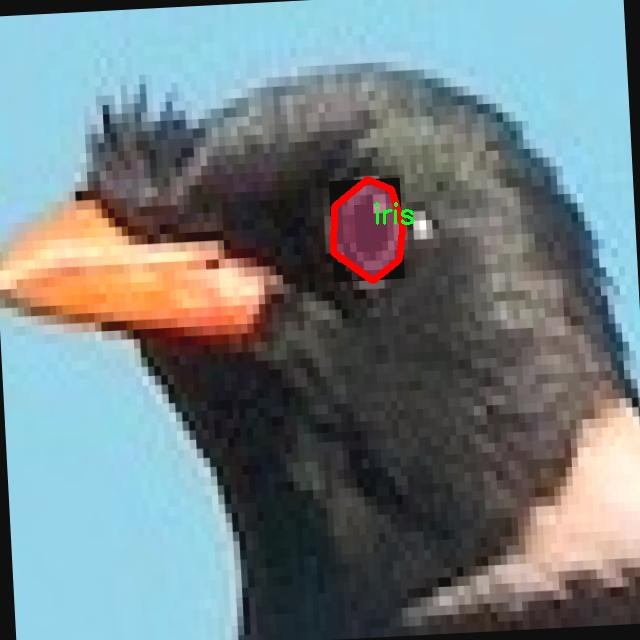
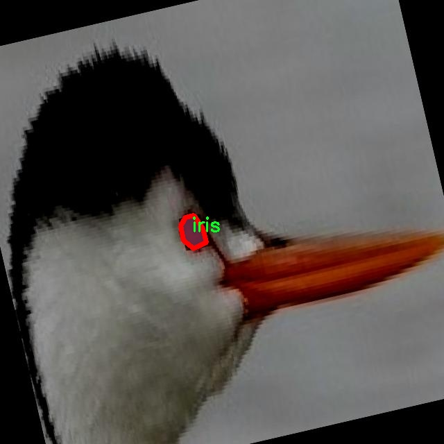

# 动物虹膜图像分割系统源码＆数据集分享
 [yolov8-seg-EfficientRepBiPAN＆yolov8-seg-C2f-DLKA等50+全套改进创新点发刊_一键训练教程_Web前端展示]

### 1.研究背景与意义

项目参考[ILSVRC ImageNet Large Scale Visual Recognition Challenge](https://gitee.com/YOLOv8_YOLOv11_Segmentation_Studio/projects)

项目来源[AAAI Global Al lnnovation Contest](https://kdocs.cn/l/cszuIiCKVNis)

研究背景与意义

随着计算机视觉技术的快速发展，图像分割在生物医学领域中的应用日益广泛，尤其是在动物虹膜图像的分析中。虹膜作为眼睛的重要组成部分，承载着丰富的生物信息，其形态特征在动物种类、健康状况及遗传研究中具有重要的指示意义。传统的虹膜分析方法多依赖于人工观察和测量，效率低下且容易受到主观因素的影响。因此，基于深度学习的自动化图像分割技术应运而生，成为提高虹膜分析效率和准确性的有效手段。

YOLO（You Only Look Once）系列模型因其高效的实时目标检测能力而受到广泛关注。YOLOv8作为该系列的最新版本，进一步提升了检测精度和速度，适用于复杂背景下的图像处理。然而，针对动物虹膜图像的特定需求，YOLOv8在实例分割方面仍存在一定的局限性。因此，改进YOLOv8以适应动物虹膜图像的分割任务，不仅具有重要的学术价值，也为实际应用提供了新的思路。

本研究基于一个包含1000张动物虹膜图像的数据集，旨在开发一个高效的虹膜图像分割系统。该数据集的单一类别“iris”使得模型在训练过程中能够集中学习虹膜的特征，减少了背景干扰，提高了分割的准确性。通过对YOLOv8模型的改进，我们将引入多种数据增强技术和优化算法，以提高模型对虹膜细微特征的识别能力。这一过程不仅将推动计算机视觉技术在生物医学领域的应用，也将为动物虹膜的研究提供更为精准的工具。

此外，动物虹膜的分割研究还具有重要的生态和保护意义。随着全球生态环境的变化，许多动物面临生存威胁，虹膜作为一种独特的生物标志，可以帮助科学家们进行种群监测和健康评估。通过建立高效的虹膜图像分割系统，研究人员能够更好地分析动物的遗传多样性、行为模式及其与环境的关系，从而为保护濒危物种提供科学依据。

综上所述，基于改进YOLOv8的动物虹膜图像分割系统的研究，不仅填补了现有技术在动物虹膜分析中的空白，也为生物医学图像处理领域提供了新的视角和方法。通过这一研究，我们期望能够推动动物虹膜的研究进展，为生态保护和生物多样性维护贡献力量。未来，该系统的成功应用还可能扩展到其他生物特征的分析中，具有广泛的应用前景和深远的社会意义。

### 2.图片演示


##### 注意：由于此博客编辑较早，上面“2.图片演示”和“3.视频演示”展示的系统图片或者视频可能为老版本，新版本在老版本的基础上升级如下：（实际效果以升级的新版本为准）

  （1）适配了YOLOV8的“目标检测”模型和“实例分割”模型，通过加载相应的权重（.pt）文件即可自适应加载模型。

  （2）支持“图片识别”、“视频识别”、“摄像头实时识别”三种识别模式。

  （3）支持“图片识别”、“视频识别”、“摄像头实时识别”三种识别结果保存导出，解决手动导出（容易卡顿出现爆内存）存在的问题，识别完自动保存结果并导出到tempDir中。

  （4）支持Web前端系统中的标题、背景图等自定义修改，后面提供修改教程。

  另外本项目提供训练的数据集和训练教程,暂不提供权重文件（best.pt）,需要您按照教程进行训练后实现图片演示和Web前端界面演示的效果。

### 3.视频演示

[3.1 视频演示](https://www.bilibili.com/video/BV1B92zYAEex/)

### 4.数据集信息展示

##### 4.1 本项目数据集详细数据（类别数＆类别名）

nc: 1
names: ['iris']


##### 4.2 本项目数据集信息介绍

数据集信息展示

在本研究中，我们采用了名为“iris_seg”的数据集，以支持对动物虹膜图像的分割任务，旨在改进YOLOv8-seg模型的性能。该数据集专注于虹膜这一特定类别，具有独特的特征和挑战性，适合用于深度学习模型的训练和评估。数据集的类别数量为1，具体类别为“iris”，即虹膜。这一单一类别的设计使得数据集在虹膜图像分割的任务中具有高度的专一性，便于模型的聚焦和优化。

“iris_seg”数据集包含了多种动物的虹膜图像，涵盖了不同的种类和个体。这些图像不仅展示了虹膜的多样性，还体现了不同光照条件、拍摄角度和背景环境对虹膜图像质量的影响。数据集中的图像经过精心挑选和标注，确保每张图像的虹膜区域都被准确地分割出来，为模型的训练提供了高质量的监督信号。这种高质量的标注不仅有助于提高模型的分割精度，也为后续的模型评估提供了可靠的基准。

在数据集的构建过程中，研究团队考虑了虹膜图像的多样性与复杂性，确保数据集能够涵盖各种可能的场景和条件。这种多样性使得模型在面对真实世界的应用时，能够具备更强的适应能力和鲁棒性。数据集中的图像包括了不同动物的虹膜特征，如猫、狗、兔子等，反映了不同物种在虹膜结构上的差异，为模型提供了丰富的学习素材。

此外，数据集的图像分辨率和质量也经过严格控制，以确保模型在训练过程中能够捕捉到虹膜的细微特征。这些细微特征对于虹膜的准确分割至关重要，因为虹膜的纹理和颜色变化可能会对分割结果产生显著影响。通过使用高分辨率的图像，模型能够更好地理解虹膜的结构特征，从而提高分割的精确度。

在训练过程中，我们将利用“iris_seg”数据集进行多轮次的迭代优化，结合YOLOv8-seg模型的强大能力，逐步调整模型参数，以实现最佳的分割效果。通过对数据集的深入分析和实验，我们期望能够提升模型在虹膜图像分割任务中的表现，推动相关领域的研究进展。

总之，“iris_seg”数据集为本研究提供了坚实的基础，支持我们在动物虹膜图像分割领域的探索与创新。通过充分利用这一数据集，我们相信能够实现对YOLOv8-seg模型的有效改进，为未来的研究和应用奠定良好的基础。







### 5.全套项目环境部署视频教程（零基础手把手教学）

[5.1 环境部署教程链接（零基础手把手教学）](https://www.bilibili.com/video/BV1jG4Ve4E9t/?vd_source=bc9aec86d164b67a7004b996143742dc)


[5.2 安装Python虚拟环境创建和依赖库安装视频教程链接（零基础手把手教学）](https://www.bilibili.com/video/BV1nA4VeYEze/?vd_source=bc9aec86d164b67a7004b996143742dc)

### 6.手把手YOLOV8-seg训练视频教程（零基础小白有手就能学会）

[6.1 手把手YOLOV8-seg训练视频教程（零基础小白有手就能学会）](https://www.bilibili.com/video/BV1cA4VeYETe/?vd_source=bc9aec86d164b67a7004b996143742dc)


按照上面的训练视频教程链接加载项目提供的数据集，运行train.py即可开始训练



     Epoch   gpu_mem       box       obj       cls    labels  img_size
     1/200     0G   0.01576   0.01955  0.007536        22      1280: 100%|██████████| 849/849 [14:42<00:00,  1.04s/it]
               Class     Images     Labels          P          R     mAP@.5 mAP@.5:.95: 100%|██████████| 213/213 [01:14<00:00,  2.87it/s]
                 all       3395      17314      0.994      0.957      0.0957      0.0843

     Epoch   gpu_mem       box       obj       cls    labels  img_size
     2/200     0G   0.01578   0.01923  0.007006        22      1280: 100%|██████████| 849/849 [14:44<00:00,  1.04s/it]
               Class     Images     Labels          P          R     mAP@.5 mAP@.5:.95: 100%|██████████| 213/213 [01:12<00:00,  2.95it/s]
                 all       3395      17314      0.996      0.956      0.0957      0.0845

     Epoch   gpu_mem       box       obj       cls    labels  img_size
     3/200     0G   0.01561    0.0191  0.006895        27      1280: 100%|██████████| 849/849 [10:56<00:00,  1.29it/s]
               Class     Images     Labels          P          R     mAP@.5 mAP@.5:.95: 100%|███████   | 187/213 [00:52<00:00,  4.04it/s]
                 all       3395      17314      0.996      0.957      0.0957      0.0845


### 7.50+种全套YOLOV8-seg创新点代码加载调参视频教程（一键加载写好的改进模型的配置文件）

[7.1 50+种全套YOLOV8-seg创新点代码加载调参视频教程（一键加载写好的改进模型的配置文件）](https://www.bilibili.com/video/BV1Hw4VePEXv/?vd_source=bc9aec86d164b67a7004b996143742dc)

### 8.YOLOV8-seg图像分割算法原理

原始YOLOv8-seg算法原理

YOLOv8-seg算法是YOLO系列中的一个重要进展，专注于目标检测与分割任务的结合。它在YOLOv8的基础上，进一步扩展了模型的功能，使其不仅能够检测目标，还能对目标进行精确的像素级分割。这一算法的设计理念是通过高效的特征提取和深度学习技术，提升目标检测和分割的精度与速度。

首先，YOLOv8-seg算法的网络结构可以分为三个主要部分：Backbone、Neck和Head。Backbone部分负责从输入图像中提取特征，采用了CSPDarknet结构。这种结构的创新之处在于其将网络分为两个部分，每个部分均包含多个残差块，从而实现了更高效的特征提取。与前代YOLOv5相比，YOLOv8-seg引入了C2f模块，这一模块通过将输入特征图分为两个分支并分别进行卷积操作，能够更好地捕捉到特征之间的关系，并有效地增强了梯度流的信息。这种设计不仅提高了特征图的维度，还在特征融合时保留了更多的上下文信息。

在特征提取的过程中，YOLOv8-seg还引入了快速空间金字塔池化（SPPF）结构。这一结构的主要功能是提取不同尺度的特征，能够有效减少模型的参数量和计算量，同时提升特征提取的效率。这一设计对于处理复杂场景中的目标检测与分割任务尤为重要，因为不同尺度的目标在图像中可能表现出不同的特征。

接下来，Neck部分采用了特征金字塔网络（FPN）和路径聚合网络（PAN）的结合，进一步增强了特征的处理能力。通过多层次的卷积和池化操作，Neck部分能够有效地处理和压缩特征图，从而为后续的目标检测和分割提供更加丰富的信息。这一部分的设计旨在解决目标在不同尺度下的检测与分割问题，使得YOLOv8-seg能够在复杂的环境中保持较高的性能。

在Head部分，YOLOv8-seg采用了解耦合的结构，将分类和回归过程分开处理。这一设计使得模型在进行目标检测时，可以更加专注于目标的定位与分类，而在进行分割时，则能够更好地处理像素级的信息。YOLOv8-seg采用了无锚框（Anchor-Free）的检测方式，直接预测目标的中心点和宽高比例。这种方法的优势在于减少了Anchor框的数量，提升了检测的速度和准确度，尤其在复杂背景下，能够更好地应对小目标的检测与分割问题。

此外，YOLOv8-seg在训练过程中引入了多种数据增强技术，如马赛克增强、自适应图片缩放和灰度填充等。这些技术不仅能够提升模型的鲁棒性，还能有效地扩展训练数据集，使得模型在面对多样化的场景时，能够保持较高的检测与分割性能。

在损失函数的设计上，YOLOv8-seg采用了BCE（Binary Cross-Entropy）作为分类损失，并结合DFL（Distribution Focal Loss）和CIoU（Complete Intersection over Union）损失函数来计算回归损失。这一组合的损失函数设计旨在提升模型的泛化能力和精准度，使得YOLOv8-seg在不同的应用场景中都能表现出色。

综上所述，YOLOv8-seg算法通过创新的网络结构和高效的特征提取方法，成功地将目标检测与分割任务结合在一起。其无锚框的检测方式、解耦合的Head结构以及多样化的数据增强策略，使得该算法在复杂环境下依然能够保持高效的性能。随着YOLOv8-seg的不断发展与优化，未来在实际应用中，其在智能监控、自动驾驶、医疗影像分析等领域的潜力将愈加显著。


### 9.系统功能展示（检测对象为举例，实际内容以本项目数据集为准）

图9.1.系统支持检测结果表格显示

  图9.2.系统支持置信度和IOU阈值手动调节

  图9.3.系统支持自定义加载权重文件best.pt(需要你通过步骤5中训练获得)

  图9.4.系统支持摄像头实时识别

  图9.5.系统支持图片识别

  图9.6.系统支持视频识别

  图9.7.系统支持识别结果文件自动保存

  图9.8.系统支持Excel导出检测结果数据


### 10.50+种全套YOLOV8-seg创新点原理讲解（非科班也可以轻松写刊发刊，V11版本正在科研待更新）

#### 10.1 由于篇幅限制，每个创新点的具体原理讲解就不一一展开，具体见下列网址中的创新点对应子项目的技术原理博客网址【Blog】：


[10.1 50+种全套YOLOV8-seg创新点原理讲解链接](https://gitee.com/qunmasj/good)

#### 10.2 部分改进模块原理讲解(完整的改进原理见上图和技术博客链接)【如果此小节的图加载失败可以通过CSDN或者Github搜索该博客的标题访问原始博客，原始博客图片显示正常】
### YOLOv8算法原理
YOLOv8算法由Glenn-Jocher 提出，是跟YOLOv3算法、YOLOv5算法一脉相承的，主要的改进点如下:
(1)数据预处理。YOLOv8的数据预处理依旧采用YOLOv5的策略,在训练时，主要采用包括马赛克增强(Mosaic)、混合增强(Mixup)、空间扰动(randomperspective)以及颜色扰动(HSV augment)四个增强手段。
(2)骨干网络结构。YOLOv8的骨干网络结构可从YOLOv5略见一斑，YOLOv5的主干网络的架构规律十分清晰，总体来看就是每用一层步长为2的3×3卷积去降采样特征图，接一个C3模块来进一步强化其中的特征，且C3的基本深度参数分别为“3/6/9/3”，其会根据不同规模的模型的来做相应的缩放。在的YOLOv8中，大体上也还是继承了这一特点，原先的C3模块均被替换成了新的C2f模块，C2f 模块加入更多的分支，丰富梯度回传时的支流。下面展示了YOLOv8的C2f模块和YOLOv5的C3模块，其网络结构图所示。


(3)FPN-PAN结构。YOLOv8仍采用FPN+PAN结构来构建YOLO的特征金字塔，使多尺度信息之间进行充分的融合。除了FPN-PAN里面的C3模块被替换为C2f模块外，其余部分与YOLOv5的FPN-PAN结构基本一致。
(4)Detection head结构。从 YOLOv3到 YOLOv5，其检测头一直都是“耦合”(Coupled)的,即使用一层卷积同时完成分类和定位两个任务，直到YOLOX的问世， YOLO系列才第一次换装“解耦头”(Decoupled Head)。YOLOv8也同样也采用了解耦头的结构，两条并行的分支分别取提取类别特征和位置特征，然后各用一层1x1卷积完成分类和定位任务。YOLOv8整体的网络结构由图所示。


(5)标签分配策略。尽管YOLOv5设计了自动聚类候选框的一些功能，但是聚类候选框是依赖于数据集的。若数据集不够充分，无法较为准确地反映数据本身的分布特征，聚类出来的候选框也会与真实物体尺寸比例悬殊过大。YOLOv8没有采用候选框策略，所以解决的问题就是正负样本匹配的多尺度分配。不同于YOLOX所使用的 SimOTA，YOLOv8在标签分配问题上采用了和YOLOv6相同的TOOD策略，是一种动态标签分配策略。YOLOv8只用到了targetboze。和target scores，未含是否有物体预测，故 YOLOv8的损失就主要包括两大部分∶类别损失和位置损失。对于YOLOv8，其分类损失为VFLLoss(Varifocal Loss)，其回归损失为CIoU Loss 与 DFL Loss 的形式。
其中 Varifocal Loss定义如下:


其中p为预测的类别得分，p ∈ [0.1]。q为预测的目标分数(若为真实类别，则q为预测和真值的 loU;若为其他类别。q为0 )。VFL Loss使用不对称参数来对正负样本进行加权，通过只对负样本进行衰减，达到不对等的处理前景和背景对损失的贡献。对正样本，使用q进行了加权，如果正样本的GTiou很高时,则对损失的贡献更大一些，可以让网络聚焦于那些高质量的样本上，即训练高质量的正例对AP的提升比低质量的更大一些。对负样本，使用p进行了降权，降低了负例对损失的贡献，因负样本的预测p在取次幂后会变得更小，这样就能够降低负样本对损失的整体贡献。

### 动态蛇形卷积Dynamic Snake Convolution

参考论文： 2307.08388.pdf (arxiv.org)

血管、道路等拓扑管状结构的精确分割在各个领域都至关重要，确保下游任务的准确性和效率。 然而，许多因素使任务变得复杂，包括薄的局部结构和可变的全局形态。在这项工作中，我们注意到管状结构的特殊性，并利用这些知识来指导我们的 DSCNet 在三个阶段同时增强感知：特征提取、特征融合、 和损失约束。 首先，我们提出了一种动态蛇卷积，通过自适应地关注细长和曲折的局部结构来准确捕获管状结构的特征。 随后，我们提出了一种多视图特征融合策略，以补充特征融合过程中多角度对特征的关注，确保保留来自不同全局形态的重要信息。 最后，提出了一种基于持久同源性的连续性约束损失函数，以更好地约束分割的拓扑连续性。 2D 和 3D 数据集上的实验表明，与多种方法相比，我们的 DSCNet 在管状结构分割任务上提供了更好的准确性和连续性。 我们的代码是公开的。 
主要的挑战源于细长微弱的局部结构特征与复杂多变的全局形态特征。本文关注到管状结构细长连续的特点，并利用这一信息在神经网络以下三个阶段同时增强感知：特征提取、特征融合和损失约束。分别设计了动态蛇形卷积（Dynamic Snake Convolution），多视角特征融合策略与连续性拓扑约束损失。 

我们希望卷积核一方面能够自由地贴合结构学习特征，另一方面能够在约束条件下不偏离目标结构太远。在观察管状结构的细长连续的特征后，脑海里想到了一个动物——蛇。我们希望卷积核能够像蛇一样动态地扭动，来贴合目标的结构。

我们希望卷积核一方面能够自由地贴合结构学习特征，另一方面能够在约束条件下不偏离目标结构太远。在观察管状结构的细长连续的特征后，脑海里想到了一个动物——蛇。我们希望卷积核能够像蛇一样动态地扭动，来贴合目标的结构。


### DCNV2融入YOLOv8
DCN和DCNv2（可变性卷积）
网上关于两篇文章的详细描述已经很多了，我这里具体的细节就不多讲了，只说一下其中实现起来比较困惑的点。（黑体字会讲解）

DCNv1解决的问题就是我们常规的图像增强，仿射变换（线性变换加平移）不能解决的多种形式目标变换的几何变换的问题。如下图所示。

可变性卷积的思想很简单，就是讲原来固定形状的卷积核变成可变的。如下图所示：


首先来看普通卷积，以3x3卷积为例对于每个输出y(p0)，都要从x上采样9个位置，这9个位置都在中心位置x(p0)向四周扩散得到的gird形状上，(-1,-1)代表x(p0)的左上角，(1,1)代表x(p0)的右下角，其他类似。

用公式表示如下：


可变性卷积Deformable Conv操作并没有改变卷积的计算操作，而是在卷积操作的作用区域上，加入了一个可学习的参数∆pn。同样对于每个输出y(p0)，都要从x上采样9个位置，这9个位置是中心位置x(p0)向四周扩散得到的，但是多了 ∆pn，允许采样点扩散成非gird形状。


偏移量是通过对原始特征层进行卷积得到的。比如输入特征层是w×h×c，先对输入的特征层进行卷积操作，得到w×h×2c的offset field。这里的w和h和原始特征层的w和h是一致的，offset field里面的值是输入特征层对应位置的偏移量，偏移量有x和y两个方向，所以offset field的channel数是2c。offset field里的偏移量是卷积得到的，可能是浮点数，所以接下来需要通过双向性插值计算偏移位置的特征值。在偏移量的学习中，梯度是通过双线性插值来进行反向传播的。
看到这里是不是还是有点迷茫呢？那到底程序上面怎么实现呢？


事实上由上面的公式我们可以看得出来∆pn这个偏移量是加在原像素点上的，但是我们怎么样从代码上对原像素点加这个量呢？其实很简单，就是用一个普通的卷积核去跟输入图片（一般是输入的feature_map）卷积就可以了卷积核的数量是2N也就是23*3==18（前9个通道是x方向的偏移量，后9个是y方向的偏移量），然后把这个卷积的结果与正常卷积的结果进行相加就可以了。
然后又有了第二个问题，怎么样反向传播呢？为什么会有这个问题呢？因为求出来的偏移量+正常卷积输出的结果往往是一个浮点数，浮点数是无法对应到原图的像素点的，所以自然就想到了双线性差值的方法求出浮点数对应的浮点像素点。


#### DCN v2
对于positive的样本来说，采样的特征应该focus在RoI内，如果特征中包含了过多超出RoI的内容，那么结果会受到影响和干扰。而negative样本则恰恰相反，引入一些超出RoI的特征有助于帮助网络判别这个区域是背景区域。

DCNv1引入了可变形卷积，能更好的适应目标的几何变换。但是v1可视化结果显示其感受野对应位置超出了目标范围，导致特征不受图像内容影响（理想情况是所有的对应位置分布在目标范围以内）。

为了解决该问题：提出v2, 主要有

1、扩展可变形卷积，增强建模能力
2、提出了特征模拟方案指导网络培训：feature mimicking scheme

上面这段话是什么意思呢，通俗来讲就是，我们的可变性卷积的区域大于目标所在区域，所以这时候就会对非目标区域进行错误识别。

所以自然能想到的解决方案就是加入权重项进行惩罚。（至于这个实现起来就比较简单了，直接初始化一个权重然后乘(input+offsets)就可以了）


可调节的RoIpooling也是类似的，公式如下：


### 11.项目核心源码讲解（再也不用担心看不懂代码逻辑）

#### 11.1 train.py

以下是对代码的核心部分进行提炼和详细注释的版本：

```python
import os
import torch
import yaml
from ultralytics import YOLO  # 导入YOLO模型库

if __name__ == '__main__':  # 确保该模块被直接运行时才执行以下代码
    # 设置训练参数
    workers = 1  # 数据加载的工作进程数
    batch = 8  # 每个批次的样本数量
    device = "0" if torch.cuda.is_available() else "cpu"  # 判断是否使用GPU

    # 获取数据集配置文件的绝对路径
    data_path = abs_path(f'datasets/data/data.yaml', path_type='current')

    # 将路径转换为Unix风格
    unix_style_path = data_path.replace(os.sep, '/')
    # 获取数据集目录路径
    directory_path = os.path.dirname(unix_style_path)

    # 读取YAML文件，保持原有顺序
    with open(data_path, 'r') as file:
        data = yaml.load(file, Loader=yaml.FullLoader)

    # 修改数据集路径项
    if 'train' in data and 'val' in data and 'test' in data:
        data['train'] = directory_path + '/train'  # 更新训练集路径
        data['val'] = directory_path + '/val'      # 更新验证集路径
        data['test'] = directory_path + '/test'    # 更新测试集路径

        # 将修改后的数据写回YAML文件
        with open(data_path, 'w') as file:
            yaml.safe_dump(data, file, sort_keys=False)

    # 加载YOLO模型配置和预训练权重
    model = YOLO(r"C:\codeseg\codenew\50+种YOLOv8算法改进源码大全和调试加载训练教程（非必要）\改进YOLOv8模型配置文件\yolov8-seg-C2f-Faster.yaml").load("./weights/yolov8s-seg.pt")

    # 开始训练模型
    results = model.train(
        data=data_path,  # 指定训练数据的配置文件路径
        device=device,  # 指定使用的设备（GPU或CPU）
        workers=workers,  # 数据加载的工作进程数
        imgsz=640,  # 输入图像的大小
        epochs=100,  # 训练的轮数
        batch=batch,  # 每个批次的样本数量
    )
```

### 代码核心部分分析与注释：
1. **导入必要的库**：
   - `os`：用于处理文件和目录路径。
   - `torch`：用于深度学习模型的训练和推理。
   - `yaml`：用于读取和写入YAML格式的配置文件。
   - `YOLO`：从`ultralytics`库中导入YOLO模型。

2. **主程序入口**：
   - 使用`if __name__ == '__main__':`确保只有在直接运行该脚本时才执行后续代码。

3. **设置训练参数**：
   - `workers`：指定用于数据加载的工作进程数。
   - `batch`：设置每个训练批次的样本数量。
   - `device`：判断是否有可用的GPU，选择相应的设备。

4. **读取和修改数据集配置**：
   - 获取数据集配置文件的绝对路径，并将其转换为Unix风格路径。
   - 读取YAML文件并修改训练、验证和测试集的路径，然后将修改后的内容写回YAML文件。

5. **加载YOLO模型**：
   - 使用指定的配置文件和预训练权重加载YOLO模型。

6. **训练模型**：
   - 调用`model.train()`方法开始训练，传入必要的参数如数据路径、设备、工作进程数、图像大小、训练轮数和批次大小。

这个代码片段的核心功能是配置和训练YOLO模型，涉及数据集路径的处理和模型的加载与训练过程。

该程序文件 `train.py` 是一个用于训练 YOLO（You Only Look Once）目标检测模型的脚本。程序首先导入了必要的库，包括操作系统库 `os`、深度学习框架 `torch`、YAML 解析库 `yaml` 以及 YOLO 模型库 `ultralytics`。此外，还导入了用于图形显示的 `matplotlib`。

在 `__main__` 块中，程序首先设置了一些训练参数，包括工作进程数 `workers`、批次大小 `batch` 和设备类型 `device`。设备类型会根据当前系统是否支持 CUDA 来决定，如果支持则使用 GPU（"0"），否则使用 CPU（"cpu"）。接着，程序通过 `abs_path` 函数获取数据集配置文件 `data.yaml` 的绝对路径，并将其转换为 UNIX 风格的路径。

随后，程序读取 YAML 文件，解析其中的数据，并获取其目录路径。它检查 YAML 文件中是否包含训练、验证和测试数据的路径。如果存在，则将这些路径修改为当前目录下的相应子目录，并将修改后的数据写回 YAML 文件。这一步确保了模型能够正确找到训练和测试数据。

接下来，程序加载 YOLO 模型的配置文件，并加载预训练的权重文件。这里使用的是 `yolov8-seg-C2f-Faster.yaml` 配置文件和 `yolov8s-seg.pt` 权重文件。值得注意的是，程序中提到不同模型对设备的要求不同，如果遇到显存不足的错误，可以尝试使用其他模型配置。

最后，程序调用 `model.train()` 方法开始训练模型，传入了训练数据的配置文件路径、设备类型、工作进程数、输入图像大小（640x640）、训练的 epoch 数（100）以及批次大小（8）。通过这些设置，程序将开始训练 YOLO 模型，以便于后续的目标检测任务。

#### 11.2 ui.py

```python
import sys
import subprocess

def run_script(script_path):
    """
    使用当前 Python 环境运行指定的脚本。

    Args:
        script_path (str): 要运行的脚本路径

    Returns:
        None
    """
    # 获取当前 Python 解释器的路径
    python_path = sys.executable

    # 构建运行命令，使用 streamlit 运行指定的脚本
    command = f'"{python_path}" -m streamlit run "{script_path}"'

    # 执行命令
    result = subprocess.run(command, shell=True)
    # 检查命令执行结果，如果返回码不为0，则表示出错
    if result.returncode != 0:
        print("脚本运行出错。")

# 实例化并运行应用
if __name__ == "__main__":
    # 指定要运行的脚本路径
    script_path = "web.py"  # 假设脚本在当前目录下

    # 运行指定的脚本
    run_script(script_path)
```

### 代码核心部分及注释说明：

1. **导入模块**：
   - `import sys`：用于访问与 Python 解释器相关的变量和函数。
   - `import subprocess`：用于执行外部命令。

2. **定义 `run_script` 函数**：
   - 此函数接收一个脚本路径作为参数，并使用当前 Python 环境运行该脚本。
   - 使用 `sys.executable` 获取当前 Python 解释器的路径，以确保使用正确的 Python 环境。

3. **构建命令**：
   - 使用 `f-string` 格式化字符串构建运行命令，命令格式为 `python -m streamlit run script_path`，用于运行 Streamlit 应用。

4. **执行命令**：
   - 使用 `subprocess.run` 执行构建的命令，并将 `shell=True` 作为参数，以便在 shell 中运行命令。
   - 检查命令的返回码，如果返回码不为0，表示执行过程中出现错误，打印错误信息。

5. **主程序入口**：
   - 使用 `if __name__ == "__main__":` 确保只有在直接运行该脚本时才会执行以下代码。
   - 指定要运行的脚本路径（此处假设为 `web.py`）。
   - 调用 `run_script` 函数，传入脚本路径以执行该脚本。

这个程序文件名为 `ui.py`，主要功能是通过当前的 Python 环境来运行一个指定的脚本，具体是使用 Streamlit 来启动一个 Web 应用。

首先，程序导入了必要的模块，包括 `sys`、`os` 和 `subprocess`。其中，`sys` 模块用于访问与 Python 解释器相关的变量和函数，`os` 模块提供了与操作系统交互的功能，而 `subprocess` 模块则用于创建新进程、连接到它们的输入/输出/错误管道，并获取它们的返回码。

接下来，程序从 `QtFusion.path` 模块中导入了 `abs_path` 函数，这个函数的作用是获取给定路径的绝对路径。

在 `run_script` 函数中，程序接受一个参数 `script_path`，这个参数是要运行的脚本的路径。函数首先获取当前 Python 解释器的路径，然后构建一个命令字符串，这个命令字符串的格式是使用 Python 解释器来运行 Streamlit，并指定要运行的脚本路径。接着，程序使用 `subprocess.run` 方法来执行这个命令，并通过 `shell=True` 参数允许在 shell 中执行命令。

如果脚本运行的返回码不为 0，说明在执行过程中出现了错误，程序会打印出“脚本运行出错”的提示信息。

在文件的最后部分，程序通过 `if __name__ == "__main__":` 语句来判断是否是直接运行该脚本。如果是，程序会调用 `abs_path` 函数来获取名为 `web.py` 的脚本的绝对路径，并将其传递给 `run_script` 函数，从而启动该脚本。

总的来说，这个程序的核心功能是通过当前的 Python 环境运行一个指定的 Streamlit 脚本，并处理可能出现的错误。

#### 11.3 ultralytics\trackers\utils\__init__.py

以下是代码的核心部分，并附上详细的中文注释：

```python
# Ultralytics YOLO 🚀, AGPL-3.0 license

# 该代码是Ultralytics YOLO（You Only Look Once）目标检测模型的基础部分
# YOLO是一种高效的实时目标检测算法，能够在单个前向传播中同时进行目标定位和分类

# 主要功能：
# 1. 加载YOLO模型
# 2. 进行目标检测
# 3. 输出检测结果

# 这里是一个伪代码示例，展示YOLO模型的核心逻辑

# 导入必要的库
import torch  # 导入PyTorch库，用于深度学习模型的构建和训练

# 定义YOLO模型类
class YOLO:
    def __init__(self, model_path):
        # 初始化模型，加载预训练权重
        self.model = torch.load(model_path)  # 加载指定路径的YOLO模型

    def detect(self, image):
        # 对输入图像进行目标检测
        results = self.model(image)  # 使用模型对图像进行推理，得到检测结果
        return results  # 返回检测结果

# 使用示例
if __name__ == "__main__":
    yolo_model = YOLO("path/to/yolo_weights.pt")  # 创建YOLO模型实例并加载权重
    image = "path/to/image.jpg"  # 指定待检测的图像路径
    detection_results = yolo_model.detect(image)  # 调用detect方法进行目标检测
    print(detection_results)  # 输出检测结果
```

### 注释说明：
1. **导入库**：使用`import torch`导入PyTorch库，这是YOLO模型实现的基础。
2. **YOLO类**：定义了一个YOLO类，包含初始化方法和目标检测方法。
3. **初始化方法**：在初始化时加载预训练的YOLO模型权重。
4. **检测方法**：该方法接收一张图像，使用YOLO模型进行推理，并返回检测结果。
5. **使用示例**：在主程序中创建YOLO模型实例，加载权重，并对指定图像进行目标检测，最后输出结果。

这段代码展示了YOLO模型的基本结构和功能，适合用于目标检测任务。

该文件是Ultralytics YOLO项目中的一个初始化文件，通常用于定义包的结构和导入必要的模块。文件开头的注释表明该项目使用的是AGPL-3.0许可证，这是一种开源许可证，允许用户自由使用、修改和分发软件，但要求在分发时也要保持相同的许可证。

在Python中，`__init__.py`文件的存在使得该目录被视为一个包，这样可以在其他模块中导入该包中的内容。虽然在提供的代码片段中没有具体的实现细节，但通常情况下，这个文件可能会包含以下内容：

1. 导入其他模块或类，以便在包中使用。
2. 定义一些包级别的变量或常量。
3. 提供包的元数据，例如版本号、作者信息等。

通过这种方式，开发者可以组织代码，使得在使用YOLO相关功能时更加方便和高效。

#### 11.4 ultralytics\models\yolo\classify\__init__.py

```python
# 导入Ultralytics YOLO库中的分类模块
# Ultralytics YOLO 🚀, AGPL-3.0 许可证

# 从yolo分类模块中导入预测、训练和验证的类
from ultralytics.models.yolo.classify.predict import ClassificationPredictor  # 导入分类预测器
from ultralytics.models.yolo.classify.train import ClassificationTrainer      # 导入分类训练器
from ultralytics.models.yolo.classify.val import ClassificationValidator      # 导入分类验证器

# 定义模块的公开接口，允许外部访问这些类
__all__ = 'ClassificationPredictor', 'ClassificationTrainer', 'ClassificationValidator'
```

### 代码核心部分说明：
1. **导入模块**：代码的核心在于从`ultralytics`库中导入了三个主要的类，分别用于分类任务的预测、训练和验证。这些类提供了实现YOLO模型分类功能所需的基本方法和属性。

2. **`__all__`声明**：`__all__`是一个特殊变量，用于定义当使用`from module import *`时，哪些名称会被导入。这里指定了三个类，使得它们可以被外部模块直接访问。

这个程序文件是Ultralytics YOLO模型库中的一个初始化文件，位于`ultralytics/models/yolo/classify`目录下。文件的主要功能是导入与分类相关的模块，并定义了该模块的公共接口。

首先，文件顶部的注释表明这是Ultralytics YOLO项目的一部分，并且该项目遵循AGPL-3.0许可证。这意味着该代码是开源的，用户可以自由使用和修改，但在分发修改后的版本时需要遵循相同的许可证条款。

接下来，文件导入了三个重要的类：`ClassificationPredictor`、`ClassificationTrainer`和`ClassificationValidator`。这些类分别用于分类任务中的预测、训练和验证。具体来说：

- `ClassificationPredictor`类可能用于处理模型的预测功能，允许用户输入数据并获取分类结果。
- `ClassificationTrainer`类则用于训练分类模型，负责模型的训练过程，包括数据加载、损失计算和参数更新等。
- `ClassificationValidator`类用于验证模型的性能，通常在训练后评估模型在验证集上的表现。

最后，`__all__`变量定义了该模块的公共接口，列出了可以被外部导入的类名。这意味着当用户使用`from ultralytics.models.yolo.classify import *`时，只会导入`ClassificationPredictor`、`ClassificationTrainer`和`ClassificationValidator`这三个类，其他未列出的内容将不会被导入。

总的来说，这个文件的主要作用是组织和暴露与YOLO分类相关的功能模块，使得用户可以方便地使用这些功能进行图像分类任务。

#### 11.5 ultralytics\utils\tal.py

以下是经过简化和注释的核心代码部分，主要关注于任务对齐分配器的实现和关键函数。

```python
import torch
import torch.nn as nn

def select_candidates_in_gts(xy_centers, gt_bboxes, eps=1e-9):
    """
    选择在真实框（gt）中的正锚点中心。

    参数:
        xy_centers (Tensor): 形状为(h*w, 2)的张量，表示锚点中心的坐标。
        gt_bboxes (Tensor): 形状为(b, n_boxes, 4)的张量，表示真实框的坐标。

    返回:
        (Tensor): 形状为(b, n_boxes, h*w)的张量，表示每个真实框中锚点的选择情况。
    """
    n_anchors = xy_centers.shape[0]
    bs, n_boxes, _ = gt_bboxes.shape
    lt, rb = gt_bboxes.view(-1, 1, 4).chunk(2, 2)  # 获取真实框的左上角和右下角坐标
    bbox_deltas = torch.cat((xy_centers[None] - lt, rb - xy_centers[None]), dim=2).view(bs, n_boxes, n_anchors, -1)
    return bbox_deltas.amin(3).gt_(eps)  # 返回每个锚点是否在真实框内的布尔值

class TaskAlignedAssigner(nn.Module):
    """
    任务对齐分配器，用于目标检测。

    属性:
        topk (int): 考虑的候选框数量。
        num_classes (int): 目标类别数量。
        alpha (float): 分类组件的权重。
        beta (float): 定位组件的权重。
        eps (float): 防止除零的小值。
    """

    def __init__(self, topk=13, num_classes=80, alpha=1.0, beta=6.0, eps=1e-9):
        """初始化任务对齐分配器对象，设置超参数。"""
        super().__init__()
        self.topk = topk
        self.num_classes = num_classes
        self.bg_idx = num_classes  # 背景类别索引
        self.alpha = alpha
        self.beta = beta
        self.eps = eps

    @torch.no_grad()
    def forward(self, pd_scores, pd_bboxes, anc_points, gt_labels, gt_bboxes, mask_gt):
        """
        计算任务对齐分配。

        参数:
            pd_scores (Tensor): 形状为(bs, num_total_anchors, num_classes)的张量，表示预测的分数。
            pd_bboxes (Tensor): 形状为(bs, num_total_anchors, 4)的张量，表示预测的边界框。
            anc_points (Tensor): 形状为(num_total_anchors, 2)的张量，表示锚点坐标。
            gt_labels (Tensor): 形状为(bs, n_max_boxes, 1)的张量，表示真实框的标签。
            gt_bboxes (Tensor): 形状为(bs, n_max_boxes, 4)的张量，表示真实框的坐标。
            mask_gt (Tensor): 形状为(bs, n_max_boxes, 1)的张量，表示有效的真实框。

        返回:
            target_labels (Tensor): 形状为(bs, num_total_anchors)的张量，表示目标标签。
            target_bboxes (Tensor): 形状为(bs, num_total_anchors, 4)的张量，表示目标边界框。
            target_scores (Tensor): 形状为(bs, num_total_anchors, num_classes)的张量，表示目标分数。
            fg_mask (Tensor): 形状为(bs, num_total_anchors)的布尔张量，表示前景锚点。
            target_gt_idx (Tensor): 形状为(bs, num_total_anchors)的张量，表示目标真实框索引。
        """
        self.bs = pd_scores.size(0)
        self.n_max_boxes = gt_bboxes.size(1)

        if self.n_max_boxes == 0:
            device = gt_bboxes.device
            return (torch.full_like(pd_scores[..., 0], self.bg_idx).to(device), 
                    torch.zeros_like(pd_bboxes).to(device),
                    torch.zeros_like(pd_scores).to(device), 
                    torch.zeros_like(pd_scores[..., 0]).to(device),
                    torch.zeros_like(pd_scores[..., 0]).to(device))

        # 获取正锚点的掩码和对齐度量
        mask_pos, align_metric, overlaps = self.get_pos_mask(pd_scores, pd_bboxes, gt_labels, gt_bboxes, anc_points, mask_gt)

        # 选择重叠度最高的真实框
        target_gt_idx, fg_mask, mask_pos = select_highest_overlaps(mask_pos, overlaps, self.n_max_boxes)

        # 获取目标标签、边界框和分数
        target_labels, target_bboxes, target_scores = self.get_targets(gt_labels, gt_bboxes, target_gt_idx, fg_mask)

        # 归一化对齐度量
        align_metric *= mask_pos
        pos_align_metrics = align_metric.amax(dim=-1, keepdim=True)  # 获取正样本的最大对齐度量
        pos_overlaps = (overlaps * mask_pos).amax(dim=-1, keepdim=True)  # 获取正样本的最大重叠度
        norm_align_metric = (align_metric * pos_overlaps / (pos_align_metrics + self.eps)).amax(-2).unsqueeze(-1)
        target_scores = target_scores * norm_align_metric  # 更新目标分数

        return target_labels, target_bboxes, target_scores, fg_mask.bool(), target_gt_idx

    def get_pos_mask(self, pd_scores, pd_bboxes, gt_labels, gt_bboxes, anc_points, mask_gt):
        """获取在真实框内的掩码。"""
        mask_in_gts = select_candidates_in_gts(anc_points, gt_bboxes)  # 获取在真实框内的锚点掩码
        align_metric, overlaps = self.get_box_metrics(pd_scores, pd_bboxes, gt_labels, gt_bboxes, mask_in_gts * mask_gt)  # 计算对齐度量和重叠度
        mask_topk = self.select_topk_candidates(align_metric, topk_mask=mask_gt.expand(-1, -1, self.topk).bool())  # 选择前k个候选框
        mask_pos = mask_topk * mask_in_gts * mask_gt  # 合并掩码

        return mask_pos, align_metric, overlaps

    def get_box_metrics(self, pd_scores, pd_bboxes, gt_labels, gt_bboxes, mask_gt):
        """计算给定预测和真实边界框的对齐度量。"""
        na = pd_bboxes.shape[-2]
        mask_gt = mask_gt.bool()  # 转换为布尔类型
        overlaps = torch.zeros([self.bs, self.n_max_boxes, na], dtype=pd_bboxes.dtype, device=pd_bboxes.device)
        bbox_scores = torch.zeros([self.bs, self.n_max_boxes, na], dtype=pd_scores.dtype, device=pd_scores.device)

        ind = torch.zeros([2, self.bs, self.n_max_boxes], dtype=torch.long)  # 2, b, max_num_obj
        ind[0] = torch.arange(end=self.bs).view(-1, 1).expand(-1, self.n_max_boxes)  # b, max_num_obj
        ind[1] = gt_labels.squeeze(-1)  # b, max_num_obj
        bbox_scores[mask_gt] = pd_scores[ind[0], :, ind[1]][mask_gt]  # 获取每个锚点的分数

        # 计算重叠度
        pd_boxes = pd_bboxes.unsqueeze(1).expand(-1, self.n_max_boxes, -1, -1)[mask_gt]
        gt_boxes = gt_bboxes.unsqueeze(2).expand(-1, -1, na, -1)[mask_gt]
        overlaps[mask_gt] = bbox_iou(gt_boxes, pd_boxes, xywh=False, CIoU=True).squeeze(-1).clamp_(0)

        align_metric = bbox_scores.pow(self.alpha) * overlaps.pow(self.beta)  # 计算对齐度量
        return align_metric, overlaps

    def get_targets(self, gt_labels, gt_bboxes, target_gt_idx, fg_mask):
        """
        计算正锚点的目标标签、目标边界框和目标分数。

        参数:
            gt_labels (Tensor): 真实框标签。
            gt_bboxes (Tensor): 真实框坐标。
            target_gt_idx (Tensor): 正锚点分配的真实框索引。
            fg_mask (Tensor): 前景掩码。

        返回:
            (Tuple[Tensor, Tensor, Tensor]): 包含目标标签、目标边界框和目标分数的元组。
        """
        batch_ind = torch.arange(end=self.bs, dtype=torch.int64, device=gt_labels.device)[..., None]
        target_gt_idx = target_gt_idx + batch_ind * self.n_max_boxes  # 计算目标真实框索引
        target_labels = gt_labels.long().flatten()[target_gt_idx]  # 获取目标标签

        target_bboxes = gt_bboxes.view(-1, 4)[target_gt_idx]  # 获取目标边界框
        target_labels.clamp_(0)  # 限制标签范围

        # 生成目标分数
        target_scores = torch.zeros((target_labels.shape[0], target_labels.shape[1], self.num_classes),
                                    dtype=torch.int64,
                                    device=target_labels.device)  # 初始化目标分数
        target_scores.scatter_(2, target_labels.unsqueeze(-1), 1)  # 根据标签填充分数

        fg_scores_mask = fg_mask[:, :, None].repeat(1, 1, self.num_classes)  # 扩展前景掩码
        target_scores = torch.where(fg_scores_mask > 0, target_scores, 0)  # 更新目标分数

        return target_labels, target_bboxes, target_scores
```

### 代码注释说明：
1. **select_candidates_in_gts**: 该函数用于判断锚点中心是否在真实框内，并返回布尔值掩码。
2. **TaskAlignedAssigner**: 该类实现了一个任务对齐的分配器，负责将真实框分配给锚点。
3. **forward**: 该方法是分配器的前向传播，计算目标标签、边界框和分数。
4. **get_pos_mask**: 该方法获取在真实框内的锚点掩码。
5. **get_box_metrics**: 该方法计算预测边界框与真实框之间的对齐度量。
6. **get_targets**: 该方法根据分配的真实框索引生成目标标签、边界框和分数。

这个程序文件 `ultralytics/utils/tal.py` 是用于目标检测任务中的一个重要模块，主要实现了与目标分配相关的功能。它包含了一些用于计算和选择锚框（anchor boxes）与真实目标（ground truth）之间关系的函数和类，帮助模型在训练过程中更好地学习。

首先，文件导入了必要的库，包括 PyTorch 和一些自定义的模块。接着，通过 `check_version` 函数检查 PyTorch 的版本，以确保代码在适当的环境中运行。

`select_candidates_in_gts` 函数用于选择在真实目标框内的锚框中心。它接收锚框中心和真实目标框的坐标，并返回一个布尔张量，指示哪些锚框中心位于真实目标框内。

`select_highest_overlaps` 函数则用于处理当一个锚框被多个真实目标框分配时的情况。它选择与锚框重叠度最高的真实目标框，并返回相应的索引和掩码。

`TaskAlignedAssigner` 类是该文件的核心部分，负责将真实目标分配给锚框。它结合了分类和定位信息，通过定义的超参数（如 `topk`、`alpha` 和 `beta`）来调整分配策略。该类的 `forward` 方法实现了目标分配的主要逻辑，包括计算正样本掩码、对目标进行选择、归一化得分等。

在 `get_pos_mask` 方法中，首先调用 `select_candidates_in_gts` 来获取锚框与真实目标框的关系，然后计算对齐度量和重叠度，最后通过 `select_topk_candidates` 选择前 `topk` 个候选锚框。

`get_box_metrics` 方法计算预测框与真实框之间的对齐度量，使用了重叠度和预测得分的组合。

`select_topk_candidates` 方法根据给定的度量选择前 `topk` 个候选框，确保不会重复选择同一个锚框。

`get_targets` 方法则用于生成目标标签、目标边界框和目标得分，确保这些信息与正样本锚框相对应。

此外，文件还定义了一些辅助函数，如 `make_anchors` 用于生成锚框，`dist2bbox` 和 `bbox2dist` 用于在不同表示形式之间转换边界框。这些函数帮助简化了锚框生成和目标框的转换过程。

总体来说，这个文件的主要目的是实现一个高效的目标分配机制，以便在目标检测模型的训练过程中更好地处理锚框与真实目标之间的关系，从而提高模型的性能。

#### 11.6 ultralytics\__init__.py

以下是保留的核心部分代码，并添加了详细的中文注释：

```python
# Ultralytics YOLO 🚀, AGPL-3.0 license

# 定义当前版本
__version__ = '8.0.202'

# 从 ultralytics.models 模块导入所需的模型
from ultralytics.models import RTDETR, SAM, YOLO  # 导入实时目标检测模型 RTDETR、分割模型 SAM 和 YOLO 模型
from ultralytics.models.fastsam import FastSAM  # 导入快速分割模型 FastSAM
from ultralytics.models.nas import NAS  # 导入神经架构搜索模型 NAS

# 导入设置和检查工具
from ultralytics.utils import SETTINGS as settings  # 导入设置配置
from ultralytics.utils.checks import check_yolo as checks  # 导入 YOLO 检查工具
from ultralytics.utils.downloads import download  # 导入下载工具

# 定义模块的公共接口，方便外部调用
__all__ = '__version__', 'YOLO', 'NAS', 'SAM', 'FastSAM', 'RTDETR', 'checks', 'download', 'settings'
```

### 注释说明：
1. **版本定义**：`__version__` 变量用于标识当前模块的版本号。
2. **模型导入**：从 `ultralytics.models` 模块中导入了多种模型，包括 YOLO、RTDETR、SAM 和 FastSAM，提供了不同的目标检测和分割功能。
3. **工具导入**：导入了设置配置、YOLO 检查工具和下载工具，便于后续的模型配置和资源获取。
4. **公共接口**：`__all__` 列表定义了模块的公共接口，指定了哪些变量和类可以被外部访问，确保模块的封装性。

这个程序文件是Ultralytics库的初始化文件，文件名为`__init__.py`，用于定义该库的基本信息和导入相关模块。首先，文件开头包含了一条注释，说明这是Ultralytics YOLO项目，并标明了其使用的AGPL-3.0许可证。接着，文件定义了一个版本号`__version__`，当前版本为'8.0.202'。

随后，文件从`ultralytics.models`模块中导入了多个模型，包括`RTDETR`、`SAM`和`YOLO`，这些模型可能是用于目标检测或图像分割等任务的深度学习模型。此外，还从`ultralytics.models.fastsam`导入了`FastSAM`，这可能是一个快速的图像分割模型。文件中还导入了`NAS`，这可能与神经架构搜索相关。

在工具方面，文件从`ultralytics.utils`模块中导入了`SETTINGS`，这可能包含了库的配置信息。同时，还导入了`check_yolo`函数用于检查YOLO模型的状态，和`download`函数用于下载所需的资源或模型。

最后，文件通过`__all__`变量定义了公共接口，列出了可以被外部访问的模块和函数，包括版本号、各个模型、检查函数、下载函数和设置。这使得用户在导入该库时，可以方便地访问这些功能。整体来看，这个初始化文件为Ultralytics库的使用提供了基本的结构和功能导入。

### 12.系统整体结构（节选）

### 整体功能和构架概括

Ultralytics库是一个用于目标检测和图像分割的深度学习框架，主要实现了YOLO（You Only Look Once）系列模型。该库的设计结构清晰，模块化程度高，便于扩展和维护。其核心功能包括模型训练、推理、目标分配、图像分割等。通过不同的模块，用户可以方便地使用预训练模型、进行自定义训练、实现图像分类和分割等任务。

### 文件功能整理表

| 文件路径                                           | 功能描述                                                     |
|---------------------------------------------------|------------------------------------------------------------|
| `C:\codeseg\codenew\code\train.py`               | 训练YOLO模型，设置训练参数，处理数据集配置文件。           |
| `C:\codeseg\codenew\code\ui.py`                  | 启动Streamlit Web应用，运行指定的脚本。                     |
| `C:\codeseg\codenew\code\ultralytics\trackers\utils\__init__.py` | 定义目标跟踪相关的模块结构，导入必要的类和函数。           |
| `C:\codeseg\codenew\code\ultralytics\models\yolo\classify\__init__.py` | 导入与YOLO分类相关的功能模块，定义公共接口。               |
| `C:\codeseg\codenew\code\ultralytics\utils\tal.py` | 实现目标分配机制，计算锚框与真实目标之间的关系。           |
| `C:\codeseg\codenew\code\ultralytics\__init__.py` | 定义库的基本信息，导入模型和工具，设置公共接口。           |
| `C:\codeseg\codenew\code\ultralytics\nn\extra_modules\dynamic_snake_conv.py` | 实现动态蛇形卷积模块，可能用于改进卷积操作的灵活性。       |
| `C:\codeseg\codenew\code\ultralytics\models\sam\modules\encoders.py` | 定义图像分割模型的编码器部分，处理输入特征。               |
| `C:\codeseg\codenew\code\ultralytics\models\sam\build.py` | 构建图像分割模型的整体结构，配置各个模块。                 |
| `C:\codeseg\codenew\code\utils.py`                | 提供通用的工具函数，可能用于数据处理和模型评估。           |
| `C:\codeseg\codenew\code\ultralytics\nn\extra_modules\ops_dcnv3\modules\__init__.py` | 定义DCNv3模块的结构，可能用于改进卷积操作。                |
| `C:\codeseg\codenew\code\ultralytics\models\yolo\pose\__init__.py` | 导入与YOLO姿态估计相关的功能模块，定义公共接口。           |
| `C:\codeseg\codenew\code\ultralytics\models\yolo\pose\train.py` | 训练YOLO姿态估计模型，设置训练参数和数据处理。             |

### 总结

通过以上文件的功能整理，可以看出Ultralytics库的设计注重模块化和可扩展性，用户可以根据需要选择不同的模块进行目标检测、图像分割和姿态估计等任务。每个模块都有明确的职责，确保了代码的可读性和可维护性。

注意：由于此博客编辑较早，上面“11.项目核心源码讲解（再也不用担心看不懂代码逻辑）”中部分代码可能会优化升级，仅供参考学习，完整“训练源码”、“Web前端界面”和“50+种创新点源码”以“14.完整训练+Web前端界面+50+种创新点源码、数据集获取”的内容为准。

### 13.图片、视频、摄像头图像分割Demo(去除WebUI)代码

在这个博客小节中，我们将讨论如何在不使用WebUI的情况下，实现图像分割模型的使用。本项目代码已经优化整合，方便用户将分割功能嵌入自己的项目中。
核心功能包括图片、视频、摄像头图像的分割，ROI区域的轮廓提取、类别分类、周长计算、面积计算、圆度计算以及颜色提取等。
这些功能提供了良好的二次开发基础。

### 核心代码解读

以下是主要代码片段，我们会为每一块代码进行详细的批注解释：

```python
import random
import cv2
import numpy as np
from PIL import ImageFont, ImageDraw, Image
from hashlib import md5
from model import Web_Detector
from chinese_name_list import Label_list

# 根据名称生成颜色
def generate_color_based_on_name(name):
    ......

# 计算多边形面积
def calculate_polygon_area(points):
    return cv2.contourArea(points.astype(np.float32))

...
# 绘制中文标签
def draw_with_chinese(image, text, position, font_size=20, color=(255, 0, 0)):
    image_pil = Image.fromarray(cv2.cvtColor(image, cv2.COLOR_BGR2RGB))
    draw = ImageDraw.Draw(image_pil)
    font = ImageFont.truetype("simsun.ttc", font_size, encoding="unic")
    draw.text(position, text, font=font, fill=color)
    return cv2.cvtColor(np.array(image_pil), cv2.COLOR_RGB2BGR)

# 动态调整参数
def adjust_parameter(image_size, base_size=1000):
    max_size = max(image_size)
    return max_size / base_size

# 绘制检测结果
def draw_detections(image, info, alpha=0.2):
    name, bbox, conf, cls_id, mask = info['class_name'], info['bbox'], info['score'], info['class_id'], info['mask']
    adjust_param = adjust_parameter(image.shape[:2])
    spacing = int(20 * adjust_param)

    if mask is None:
        x1, y1, x2, y2 = bbox
        aim_frame_area = (x2 - x1) * (y2 - y1)
        cv2.rectangle(image, (x1, y1), (x2, y2), color=(0, 0, 255), thickness=int(3 * adjust_param))
        image = draw_with_chinese(image, name, (x1, y1 - int(30 * adjust_param)), font_size=int(35 * adjust_param))
        y_offset = int(50 * adjust_param)  # 类别名称上方绘制，其下方留出空间
    else:
        mask_points = np.concatenate(mask)
        aim_frame_area = calculate_polygon_area(mask_points)
        mask_color = generate_color_based_on_name(name)
        try:
            overlay = image.copy()
            cv2.fillPoly(overlay, [mask_points.astype(np.int32)], mask_color)
            image = cv2.addWeighted(overlay, 0.3, image, 0.7, 0)
            cv2.drawContours(image, [mask_points.astype(np.int32)], -1, (0, 0, 255), thickness=int(8 * adjust_param))

            # 计算面积、周长、圆度
            area = cv2.contourArea(mask_points.astype(np.int32))
            perimeter = cv2.arcLength(mask_points.astype(np.int32), True)
            ......

            # 计算色彩
            mask = np.zeros(image.shape[:2], dtype=np.uint8)
            cv2.drawContours(mask, [mask_points.astype(np.int32)], -1, 255, -1)
            color_points = cv2.findNonZero(mask)
            ......

            # 绘制类别名称
            x, y = np.min(mask_points, axis=0).astype(int)
            image = draw_with_chinese(image, name, (x, y - int(30 * adjust_param)), font_size=int(35 * adjust_param))
            y_offset = int(50 * adjust_param)

            # 绘制面积、周长、圆度和色彩值
            metrics = [("Area", area), ("Perimeter", perimeter), ("Circularity", circularity), ("Color", color_str)]
            for idx, (metric_name, metric_value) in enumerate(metrics):
                ......

    return image, aim_frame_area

# 处理每帧图像
def process_frame(model, image):
    pre_img = model.preprocess(image)
    pred = model.predict(pre_img)
    det = pred[0] if det is not None and len(det)
    if det:
        det_info = model.postprocess(pred)
        for info in det_info:
            image, _ = draw_detections(image, info)
    return image

if __name__ == "__main__":
    cls_name = Label_list
    model = Web_Detector()
    model.load_model("./weights/yolov8s-seg.pt")

    # 摄像头实时处理
    cap = cv2.VideoCapture(0)
    while cap.isOpened():
        ret, frame = cap.read()
        if not ret:
            break
        ......

    # 图片处理
    image_path = './icon/OIP.jpg'
    image = cv2.imread(image_path)
    if image is not None:
        processed_image = process_frame(model, image)
        ......

    # 视频处理
    video_path = ''  # 输入视频的路径
    cap = cv2.VideoCapture(video_path)
    while cap.isOpened():
        ret, frame = cap.read()
        ......
```


### 14.完整训练+Web前端界面+50+种创新点源码、数据集获取


# [下载链接：https://mbd.pub/o/bread/Zp2TmJ9p](https://mbd.pub/o/bread/Zp2TmJ9p)